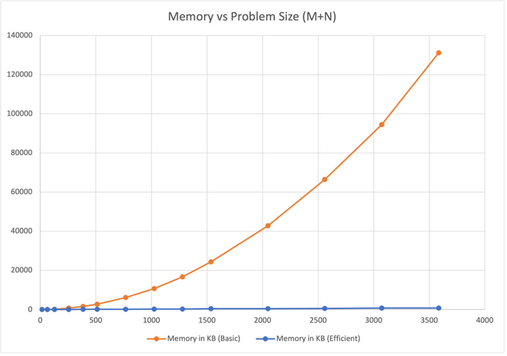
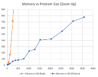
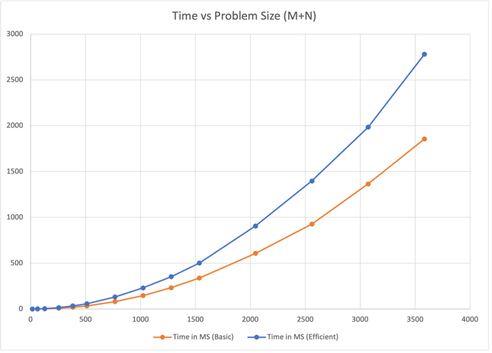

# Two algorithms of Sequence Alignment 

Project of USC CSCI570 

## Project Description

The project is related to the implementation of the two different solutions for the *Sequence Alignment* problem. 

For the basic algorithm, it uses dynamic programming (dp) to solve the problem. For the efficient algorithm, it combines dp and 'divide and conquer' to solve the problem. It's more efficient on it's space complexity.

For the project description in details, please view the CSCI570_Spring_FinalProject.pdf.


## Run the basic and efficient algs using commands as follows:

```shell
bash basic.sh input.txt output.txt
```

```shell
bash efficient.sh input.txt output.txt
```

### (Be sure the input.txt file exists, or change to any filename you want to input) 

## Datapoints And Charts

| M+N  | Time  in MS (Basic) | Time  in MS (Efficient) | Memory  in KB (Basic) | Memory  in KB (Efficient) |
| ---- | ------------------- | ----------------------- | --------------------- | ------------------------- |
| 16   | 0.05316734313964844 | 0.1499652862548828      | 4                     | 12                        |
| 64   | 0.5869865417480469  | 1.1839866638183594      | 48                    | 16                        |
| 128  | 2.1970272064208984  | 4.136085510253906       | 172                   | 28                        |
| 256  | 8.646249771118164   | 14.66989517211914       | 712                   | 64                        |
| 384  | 18.947839736938477  | 33.38217735290527       | 1608                  | 80                        |
| 512  | 33.06126594543457   | 56.799888610839844      | 2760                  | 84                        |
| 768  | 79.86688613891602   | 130.51915168762207      | 6108                  | 104                       |
| 1024 | 146.70896530151367  | 230.08084297180176      | 10740                 | 228                       |
| 1280 | 232.19680786132812  | 352.85115242004395      | 16704                 | 256                       |
| 1536 | 337.2800350189209   | 500.92291831970215      | 24336                 | 412                       |
| 2048 | 607.5329780578613   | 906.174898147583        | 42772                 | 424                       |
| 2560 | 927.3970127105713   | 1397.5167274475098      | 66456                 | 552                       |
| 3072 | 1365.427017211914   | 1984.7710132598877      | 94532                 | 712                       |
| 3584 | 1855.2932739257812  | 2781.5098762512207      | 131128                | 776                       |
| 3968 | 2291.757106781006   | 3482.067108154297       | 140948                | 876                       |







Insight and Explaination

As M+N increases, the time and memory of both algorithms increase obviously. 

In terms of running speed (time), when M+N increases, the Efficient algorithm is always slower than the Basic algorithm, but the running time of the Efficient algorithm is always about 1.5 times longer than that of the Basic algorithm.

In terms of memory usage, the Efficient algorithm uses more memory than the Basic algorithm when M+N is small at the beginning. But once M+N starts to increase, the Efficient algorithm will use less memory, and the memory usage gap between the two algorithms will become larger and larger. 

For the Basic Algorithm, it stores the entire solution table, which is a table have M columns and N rows. So, the space complicity will be O(MN), which is polynomial.

For the Memory Efficient Algorithm, it only stores two columns ad N rows, because the solution will be returned recursively, we don’t need to store the hole table. So, the space complicity will be O(N), which is linear. While, when the M+N is small, the Memory Efficient Algorithm may use more memory because the algorithm requires more space to swap two rows of data.

So, just like it shows in Graph1, the Memory Efficient Algorithm will have a huge improvement for the memory space complexity when the size of problem growing.

For the Basic Algorithm, it take M*N times to fill the solution space. And every time we fill the cell using constant time using recursion formula. So, the time complicity will be O(MN), which is polynomial.

For the Memory Efficient Algorithm, in the root level of recursion, the dividing issue will takes time CMN. The next level will take time 1/2*CMN, and 1/4*CMN …… So, add all them up it will take time 2CMN, which equals to O(MN). While it has the same time complicity with the Basic Algorithm, we can find that Memory Efficient Algorithm is always slower than the Basic Algorithm, it is because there will be more operations when dividing and conquering. For calling function recursively, swapping two columns, computing the solution space over and over times when dividing(but the space size will become more and more smaller), it all cost time. So, in Graph2, we can see Memory Efficient Algorithm cost more time, but they are still in the same bound O(MN), which is polynomial.

## shell commands for generating data points of charts

```shell
sh basic.sh datapoints/in1.txt datapoints/out1b.txt 
sh basic.sh datapoints/in2.txt datapoints/out2b.txt 
sh basic.sh datapoints/in3.txt datapoints/out3b.txt 
sh basic.sh datapoints/in4.txt datapoints/out4b.txt 
sh basic.sh datapoints/in5.txt datapoints/out5b.txt 
sh basic.sh datapoints/in6.txt datapoints/out6b.txt 
sh basic.sh datapoints/in7.txt datapoints/out7b.txt 
sh basic.sh datapoints/in8.txt datapoints/out8b.txt 
sh basic.sh datapoints/in9.txt datapoints/out9b.txt 
sh basic.sh datapoints/in10.txt datapoints/out10b.txt 
sh basic.sh datapoints/in11.txt datapoints/out11b.txt 
sh basic.sh datapoints/in12.txt datapoints/out12b.txt 
sh basic.sh datapoints/in13.txt datapoints/out13b.txt 
sh basic.sh datapoints/in14.txt datapoints/out14b.txt 
sh basic.sh datapoints/in15.txt datapoints/out15b.txt 

sh efficient.sh datapoints/in1.txt datapoints/out1e.txt
sh efficient.sh datapoints/in2.txt datapoints/out2e.txt
sh efficient.sh datapoints/in3.txt datapoints/out3e.txt
sh efficient.sh datapoints/in4.txt datapoints/out4e.txt
sh efficient.sh datapoints/in5.txt datapoints/out5e.txt
sh efficient.sh datapoints/in6.txt datapoints/out6e.txt
sh efficient.sh datapoints/in7.txt datapoints/out7e.txt
sh efficient.sh datapoints/in8.txt datapoints/out8e.txt
sh efficient.sh datapoints/in9.txt datapoints/out9e.txt
sh efficient.sh datapoints/in10.txt datapoints/out10e.txt
sh efficient.sh datapoints/in11.txt datapoints/out11e.txt
sh efficient.sh datapoints/in12.txt datapoints/out12e.txt
sh efficient.sh datapoints/in13.txt datapoints/out13e.txt
sh efficient.sh datapoints/in14.txt datapoints/out14e.txt
sh efficient.sh datapoints/in15.txt datapoints/out15e.txt
```

